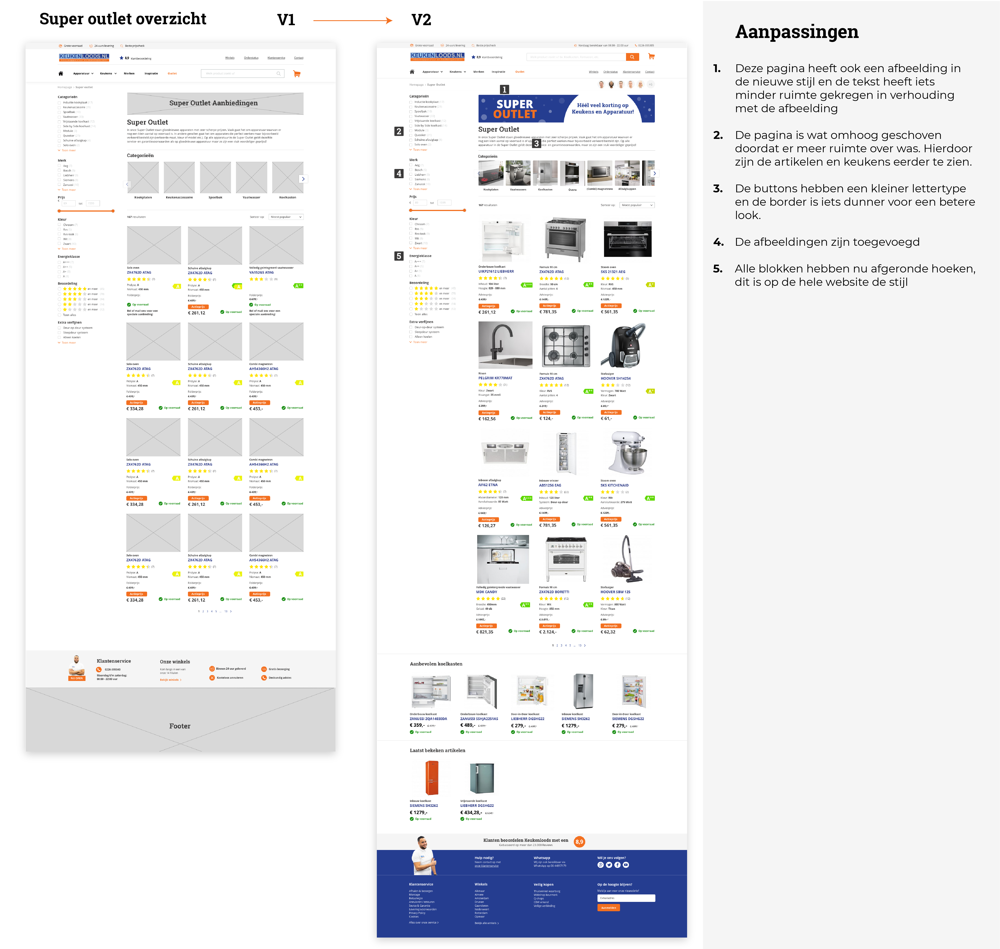

# Iteratie 1: V1 naar V2

#### Bekijk alle schermen van versie 2 en het prototype hier: [https://invis.io/HZS7GLWPTC8](https://invis.io/HZS7GLWPTC8)

Op deze pagina geef ik per scherm aan wat de belangrijkste veranderingen zijn die ik heb doorgevoerd in mijn v2 van de schermen. Deze veranderingen zijn tot stand gekomen uit de feedback van de 4.6 User tests v1 en mijn eigen verbeteringen die ik heb doorgevoerd, doordat ik vond dat het anders of beter kon.

