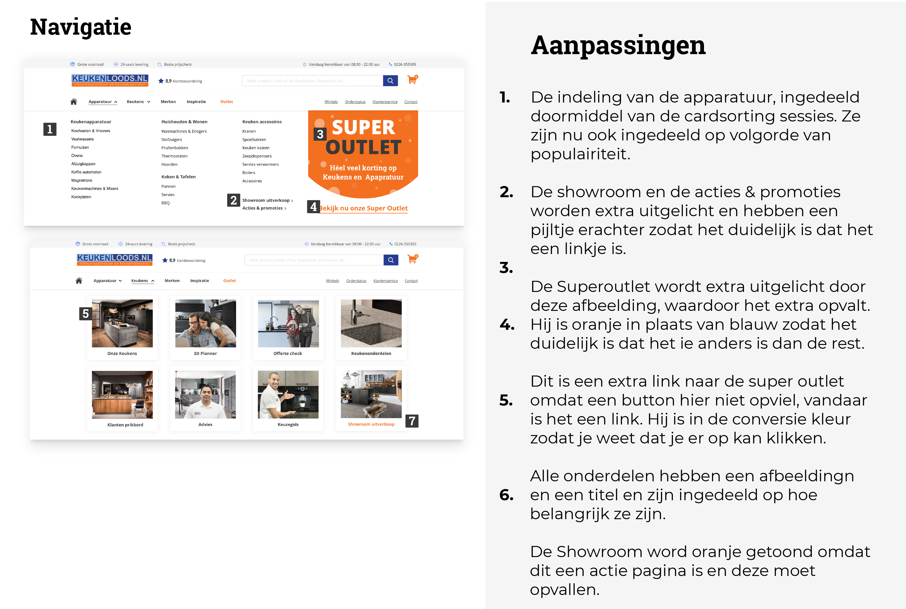
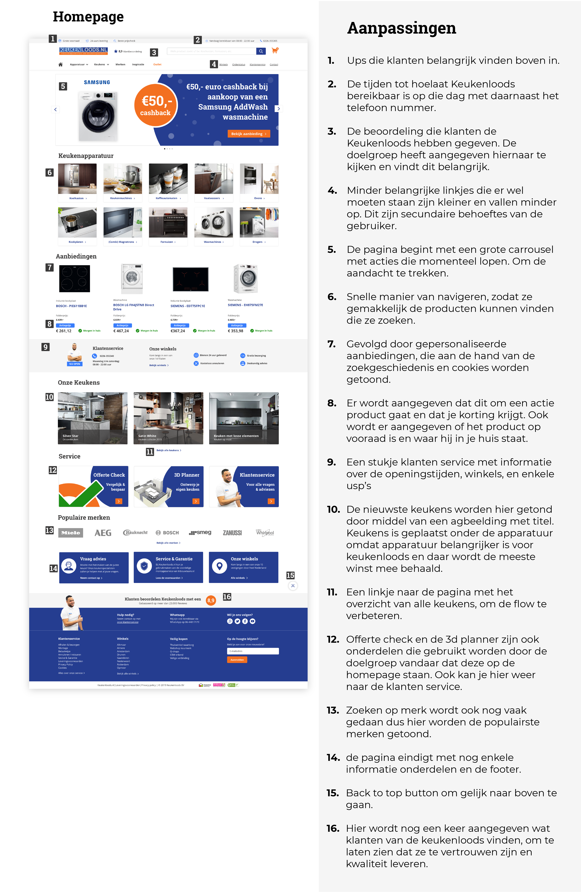
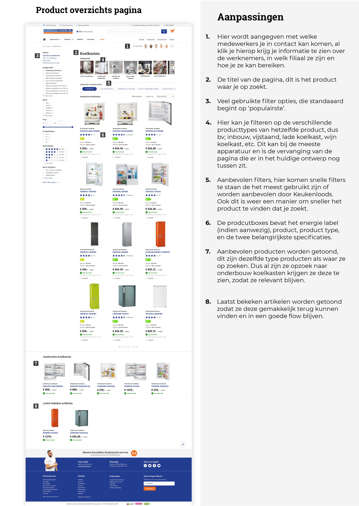
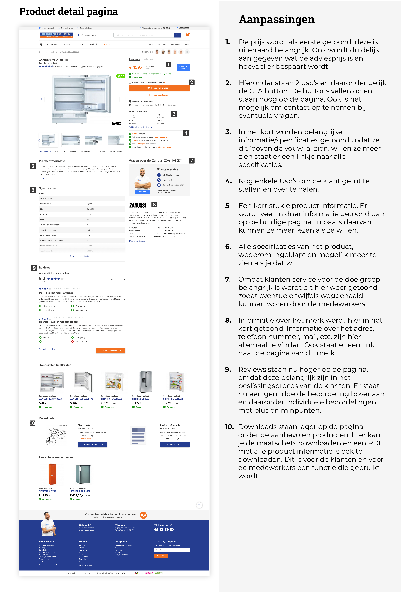
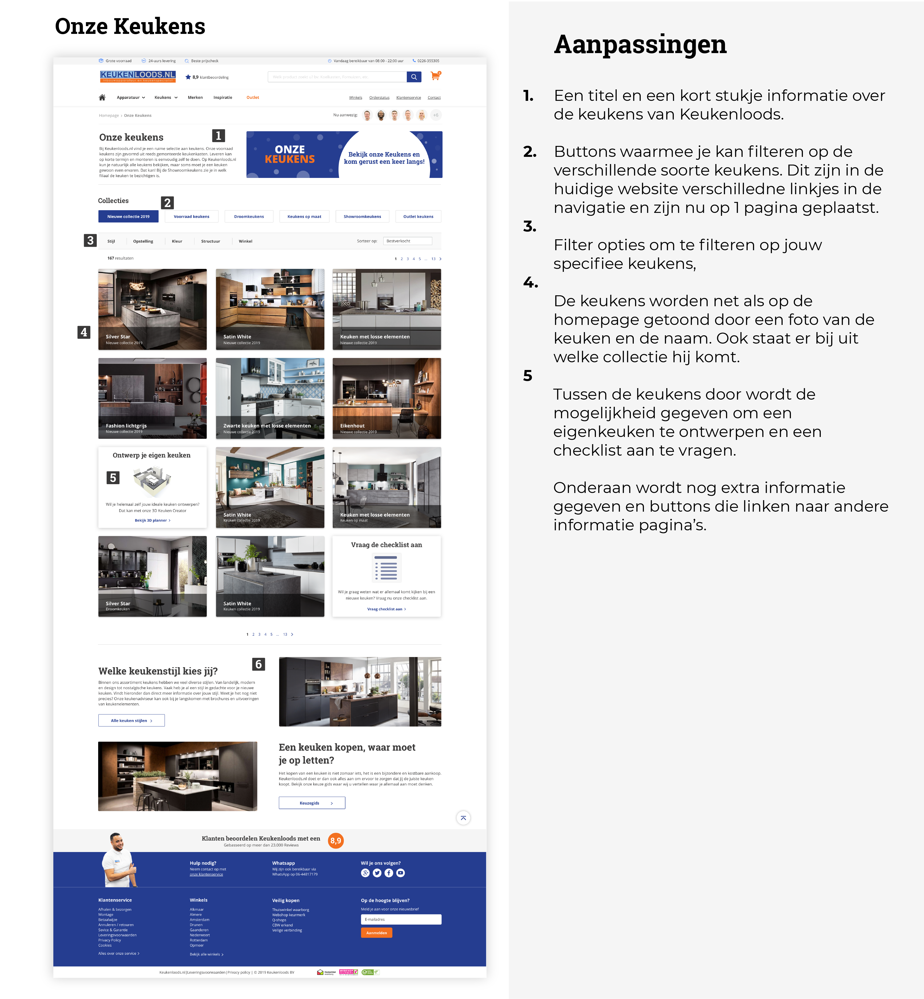
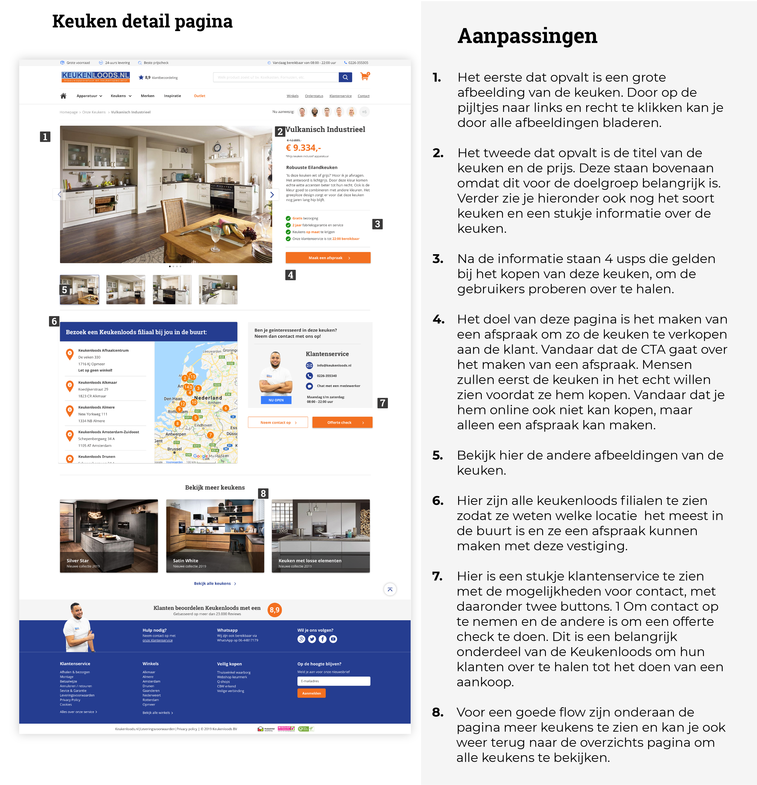
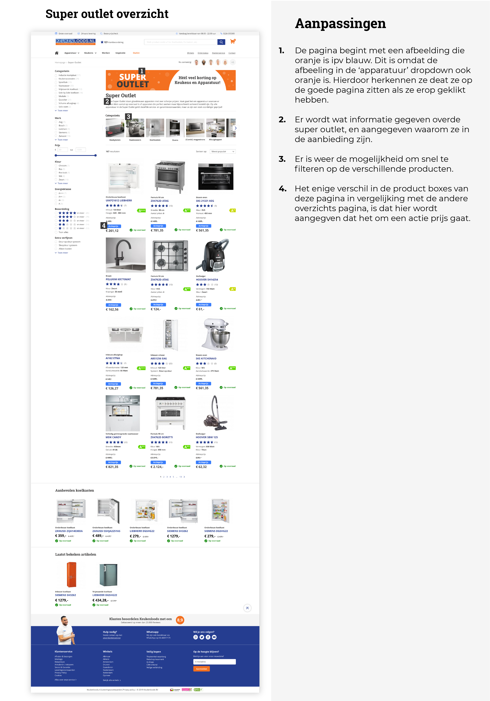
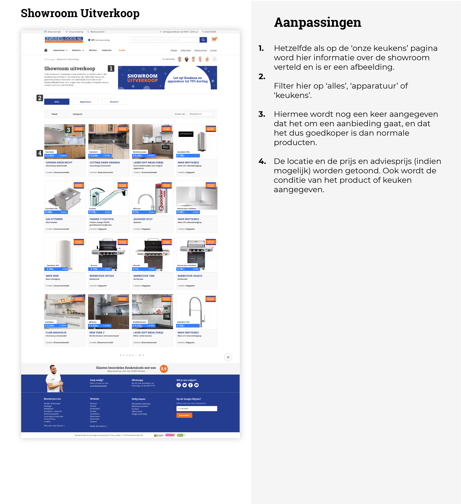
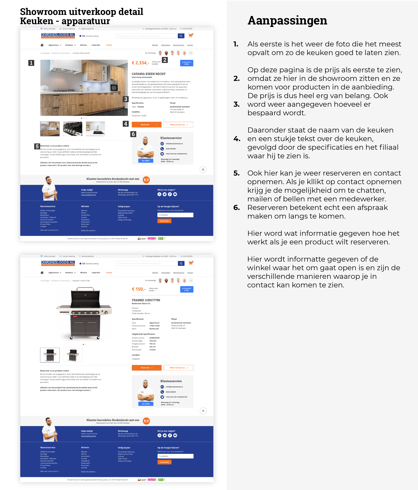
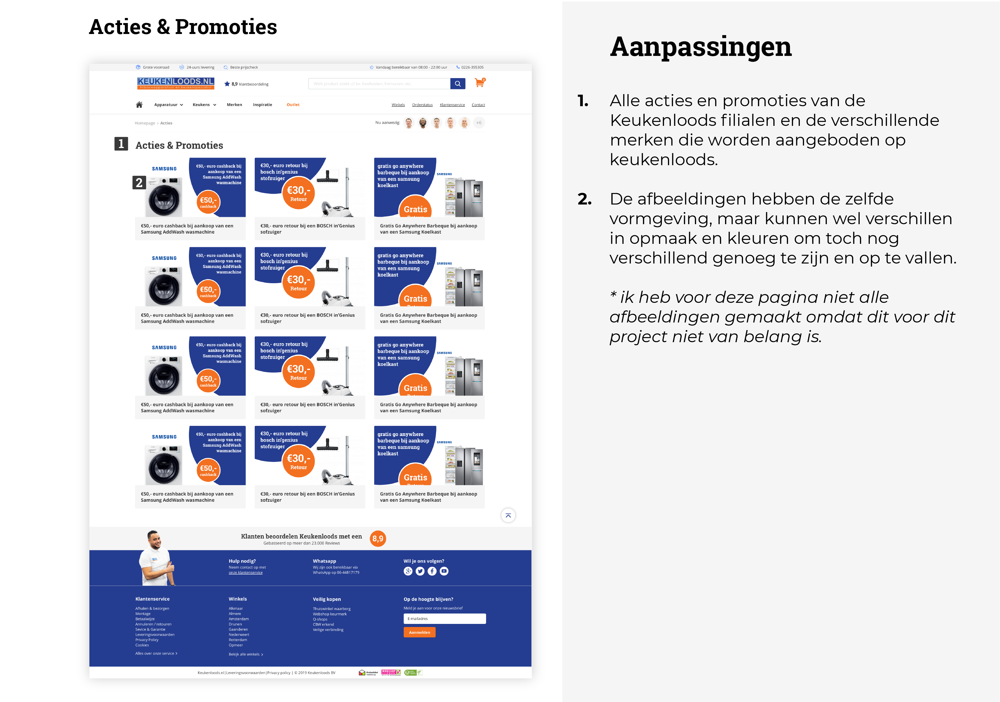

# Laatste versie - De onderbouwing

Op deze pagina zijn de schermen te zien die het na enkele iteraties en tests geworden zijn. Hier is te zien hoe ze eruitzien en ik geef mijn onderbouwing van de keuzes aan. 

Bekijk het prototype hier: [https://invis.io/9BSG7JRZT3C](https://invis.io/9BSG7JRZT3C)

