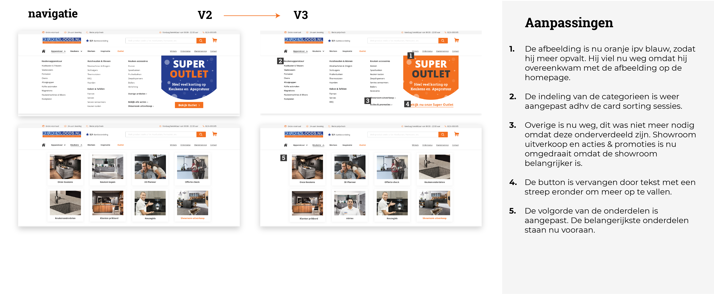
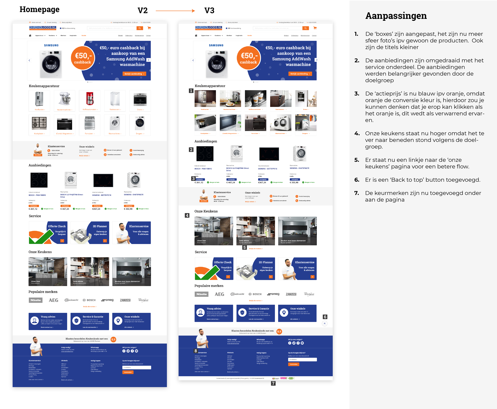
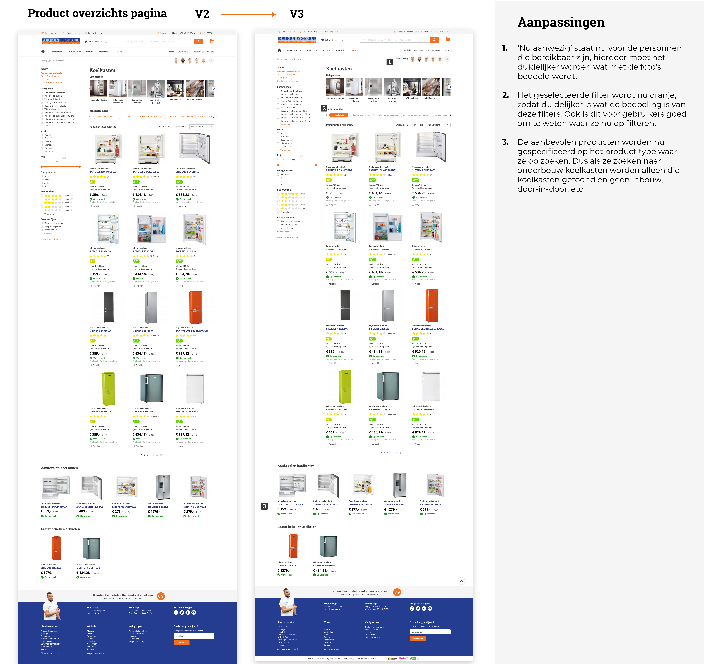
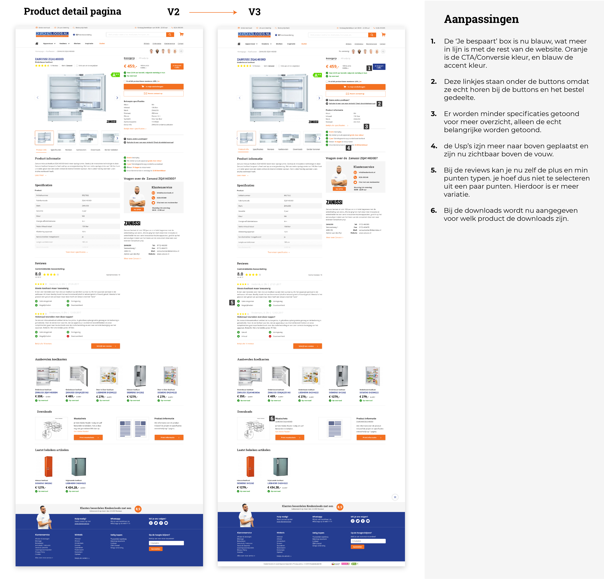
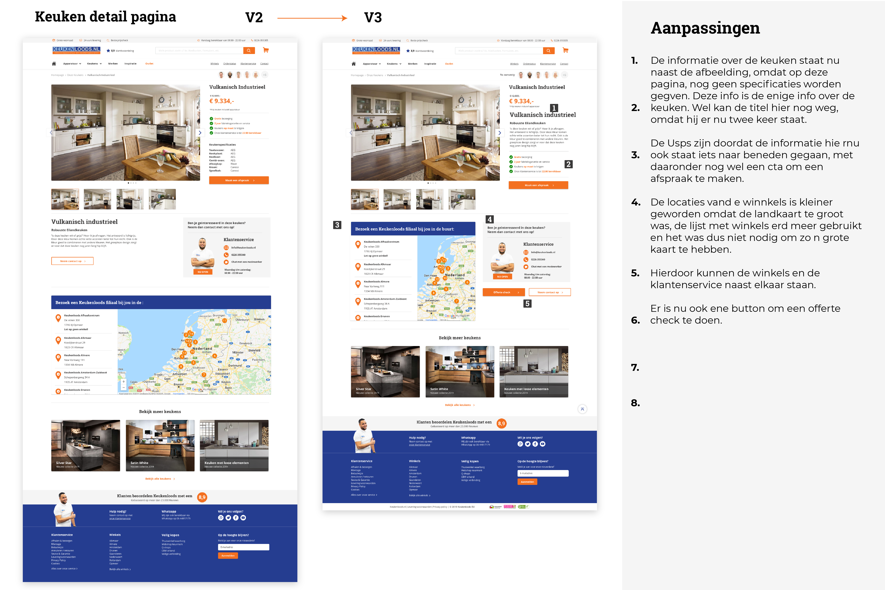

# Iteratie 2: V2 naar V3

Op deze pagina zijn weer de veranderingen te lezen van de schermen die zijn toegepast. Ook deze veranderingen komen voort uit de user tests V2 die ik heb gedaan. Het was wel duidelijk dat de schermen een verbetering waren ten opzichte van de vorige versie, er waren namelijk minder feedback punten. De punten die ik verbeterd heb zijn hieronder te lezen.

Bekijk ook het prototype: [https://invis.io/M5SF2GWGB2W](https://invis.io/M5SF2GWGB2W)

