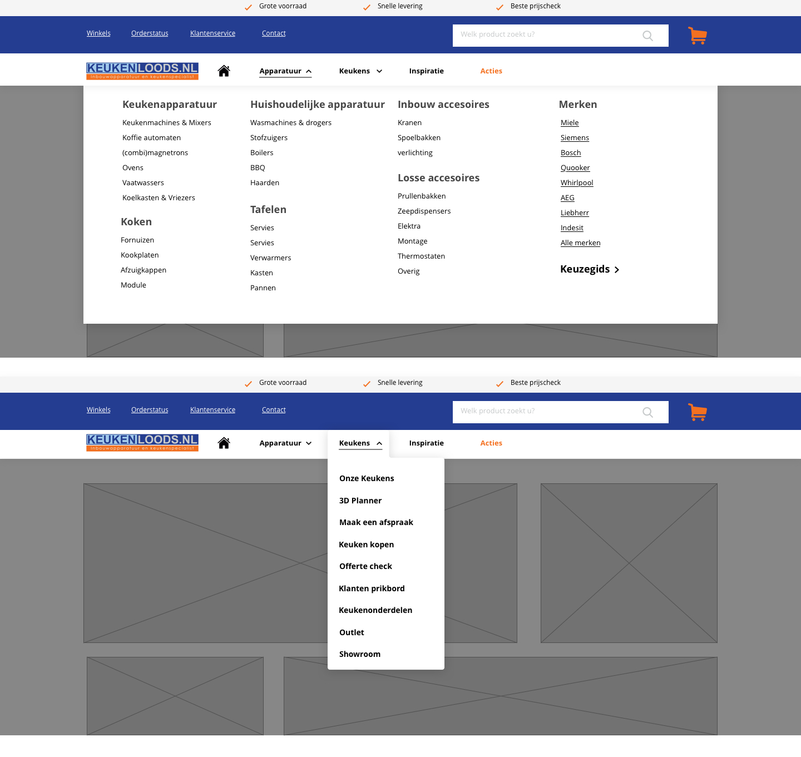

# 4.3 Nieuwe navigatie

Voor de feedback frenzy wilde ik de verschillende navigaties die ik zou gaan maken af hebben, zodat ik van mijn mede studenten en begeleiders feedback kon krijgen over het idee.  Hiervoor ben ik dus eerst verschillende navigaties gaan uit tekenen. Hierbij heb ik geprobeerd om de navigaties zo verschillend mogelijk te houden, zodat ik kon divergeren en convergeren naar een uiteindelijk idee. Hieronder zijn enkele schetsen te zien. 

Vervolgens ben ik de schermen digitaal gaan uitwerken. Om te beginnen heb ik 3 navigaties uit gewerkt, waarvan navigatie 2 dus de navigatie is waarbij wordt gefocust op het doel van de gebruiker. 

Bij deze navigatie zijn de categorieën ook al ingedeeld zoals ik het had bedacht doormiddel van Card Sorting. Dit is nog wel voor de User tests en het Card Sorting met de doelgroep, deze aanpassingen komen als ik de feedback van die tests heb verwerkt.

Navigatie 3 heb ik na de feedback frenzy en na met mijn collega's te over leggen laten vallen omdat met deze navigatie te veel 'problemen' waren waardoor het niet zou gaan werken of die beter op een andere manier konden.

