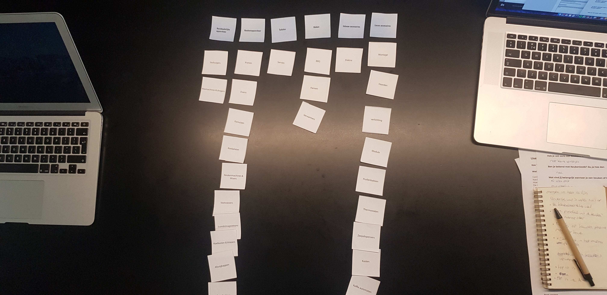
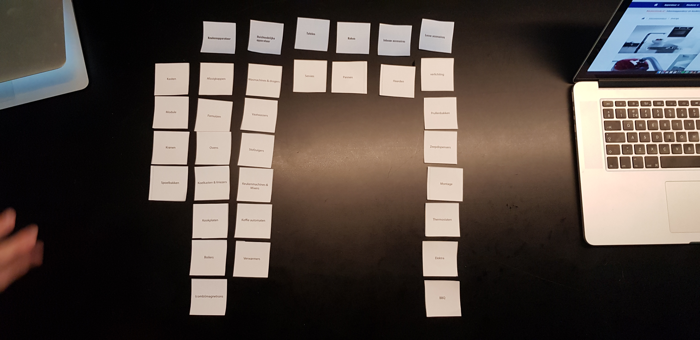
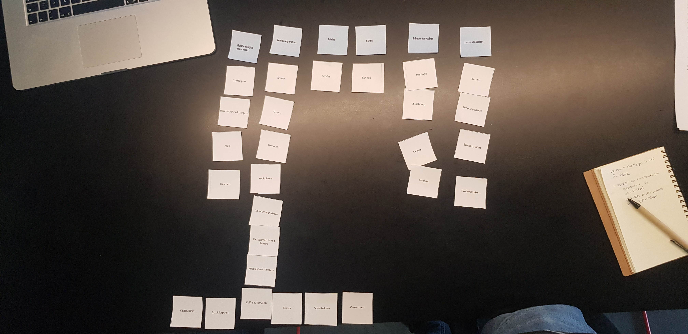
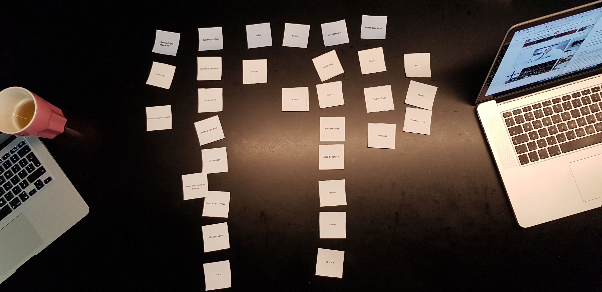

# 4.7 Card Sorting v1

Een belangrijk onderdeel van mijn afstudeer opdracht is de navigatie, hier heb ik mij ook veel op gefocust. Zo heb ik dus ook Card Sorting gedaan met 5 personen uit de doelgroep. Hiermee wilde ik testen en kijken  hoe de doelgroep dacht over mijn indeling van de categorieën en hoe hun het zouden indelen.

Tijdens deze tests waren er een paar dingen die belangrijk waren:

* Wat vinden ze van de benamingen?
* Zijn de titels waaronder alles is ingedeeld duidelijk en logisch?
* Hoe zouden ze het zelf indelen?
* Waar liggen de overeenkomsten tussen alle testpersonen?

Belangrijk voor mij was dat ik niet alleen ging opletten op hoe ze de producten indeelden, maar vooral ook waarom ze bepaalde dingen deden of juist niet deden.

### Wat waren de belangrijke bevindingen van deze sessie?

* De titels van de categorieën zorgde voor veel verwarring omdat deze niet duidelijk genoeg waren.
* De categorieën tafelen en koken samenvoegen of helemaal veranderen van naam.
* De product namen: Montage, Elektra, kasten, verwarmers en modules zijn verwarrend, ze weten niet wat hiermee bedoeld wordt
* De titels: Inbouw -  en Losse accesoires worden bij iedereen anders ingedeeld. Deze zijn dus niet duidelijk
* Het valt op dat Haarden, BBQ en thermostaten andere producten zijn dan de rest van de producten.
* Het is belangrijk om de volgorde van de producten te doen op populariteit of op alfabetische volgorde.

Het belangrijkste dat uit deze tests is gekomen is dat de titels van de categorieën niet goed genoeg aansluiten bij de producten die eronder zitten, deze moeten dus nog verbeterd worden.

Als je alle indelingen van de testpersonen gaat vergelijken is te zien dat ze heel erg verschillend zijn per persoon. Dit komt vooral doordat de titels van de categorieën niet overeenkomen met wat ze verwacht hadden. Hierdoor is het voor mij lastig om vanuit de indelingen die de test personen hebben gemaakt een nieuwe indeling te maken. Voordat ik dit kan doen moet ik eerste nieuwe categorieën bedenken en nog een ronde Card Sorting doen. Dit ga ik dus in mijn volgende iteratie nog een keer doen, maar dan met een verbeterde versie van de huidige indeling, aangezien ik deze feedback dan heb verwerkt.



De indelingen die de test personen nu hebben gebruikt ga ik nu gebruiken door te kijken of er producten zijn die vaker bij elkaar worden gezet en door als ik een nieuwe indeling ga maken de gemaakte indelingen erbij te pakken, zodat ik bij twijfelgevallen kan kijken hoe de doelgroep dit zou doen en dit vervolgens op mijn indeling ook toepassen. Op deze manier heb ik straks een indeling die is gebaseerd op mensen uit de doelgroep op een manier hoe zij dat ook zouden doen. Zo kan ik mijn uiteindelijke indeling dus onderbouwen.



De volgende stap voor mij is nu het verwerken van deze feedback en vervolgens nog een ronde Card Sorting te gaan doen met nieuwe testpersonen uit de doelgroep.



**Judith de Vries**




**Linn Jutte**




**Rosanne Smit**




**Nikki Elissen**




**Sawita Autar**




