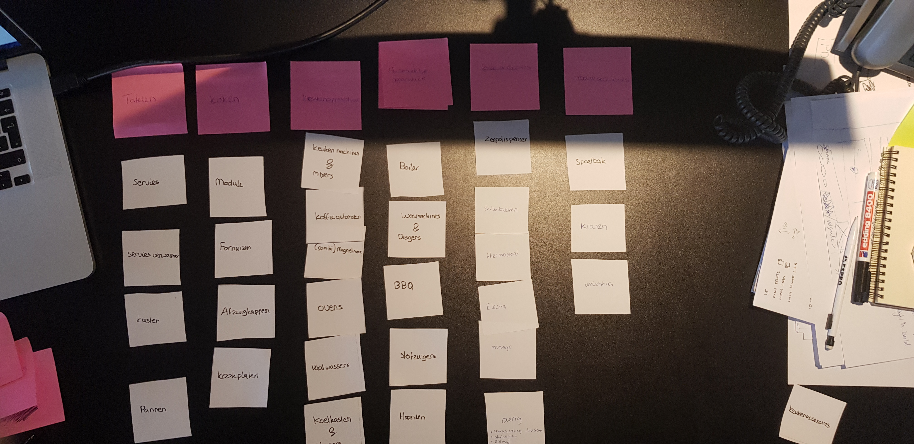

# 4.2 Nieuwe Indeling navigatie

Uit mijn analyse is gekomen dat de navigatie van de huidige website niet goed is en opnieuw ontworpen moet worden. Dit is dus ook iets waar ik veel aandacht aan heb besteed omdat een slechte navigatie op een webshop lijdt tot minder conversie. 

In de huidige verdeling waren een aantal dingen die niet klopte of die overeen kwamen met de verwachtingen van de gebruikers. Zo had je bijvoorbeeld de categorie 'overige' maar als je hier dan naartoe ging kreeg je producten te zien die ook al in het menu te zien waren. Dus daar zag je bijvoorbeeld de kranen, servies, pannen, etc. Dus die worden dubbel gebruikt. Daarnaast heb je ook nog het 'Onze keuken' kopje, waar verschillende categorieën van keuken pagina's onderstaan. Maar de pagina's die hier onderstaan leiden allemaal naar dezelfde pagina. Zo waren er nog een aantal dingen die beter konden.

Om deze reden ik dus doormiddel van Cardsorting geprobeerd om een indeling te maken die logischer ingedeeld is. Hiervoor ben ik alle verschillende producten gaan opschrijven en heb ik deze onderverdeeld op een manier waarvan ik dacht dat beter zou passen. Vervolgens ben ik hier titels voor gaan verzinnen en heb ik alles onderverdeeld. In de onderstaande afbeelding is het resultaat te zien van de indeling die ik heb bedacht.

### Wat heb ik aangepast?

In dit menu zijn er een aantal dingen die ik heb aangepast. Zo heb ik gekeken naar alle producten die verkocht worden en heb ik deze een naam gegeven zoals: Elektra, Montage, Haarden en Module. Dit deze zitten op de huidige website verstopt onder '**Overige'.** Maar ik heb geprobeerd om zo min mogelijk artikelen onder het overige kopje te zetten, omdat je dan niet kan zien dat deze producten ook verkocht worden. Ook kwam uit mijn usability tests dat de gebruikers het kopje overig vermijden en dus bijna nooit gebruiken.

Nu ik dit voor mijzelf gedaan heb, ga ik dit opnieuw testen tijdens mijn eerste User tests met gebruiker uit de doelgroep. Zij krijgen dan van mij de opdracht om ook de verschillende producten onder te verdelen bij de categorieën waarvan zij vinden dat het hoort. 





