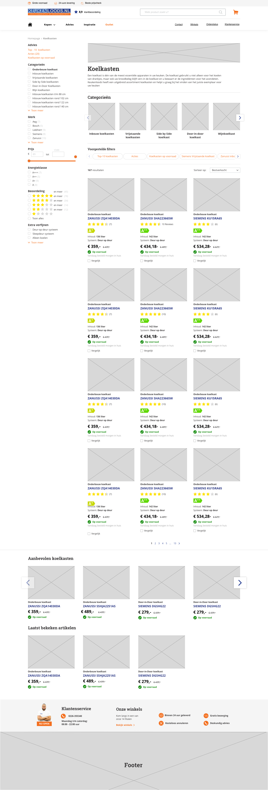

# 4.5 Digitale schermen v1

Na het schetsen heb ik het er met collega's van design over gehad, en hebben we alle schermen besproken. Deze feedback heb ik nog verwerkt voordat ik begon aan de digitale, uitwerking van de wireframes. Ik heb er bewust voor gekozen om het prototype te testen met digitale schermen, omdat het voor mijn ontwerp belangrijk is dat de indeling en de informatie op de pagina duidelijk is. Ook zijn staat op sommige zoveel informatie dat dit met een paper prototype niet duidelijk genoeg zou kunnen zijn. 

Bij het maken van deze schermen heb ik dus mijn keuzes gebaseerd op wat er is voorgekomen uit mijn onderzoeken, testen, etc. 

Omdat ik twee verschillende navigaties wil testen heb ik ook 2 verschillende prototypes gemaakt. Deze prototypes hebben dus beiden een verschillende navigatie.

**Navigatie 1:** [https://invis.io/QMRTEM5GJRD](https://invis.io/QMRTEM5GJRD)

**Navigatie 2:** [https://invis.io/FNRTCPVTGYD](https://invis.io/FNRTCPVTGYD)

