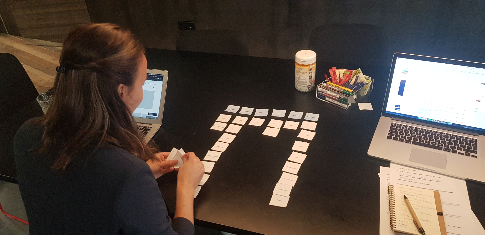
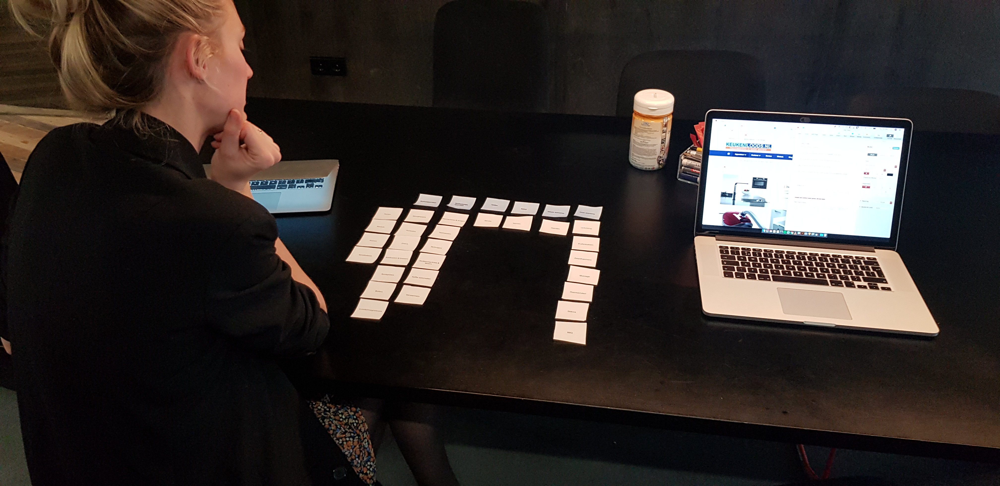
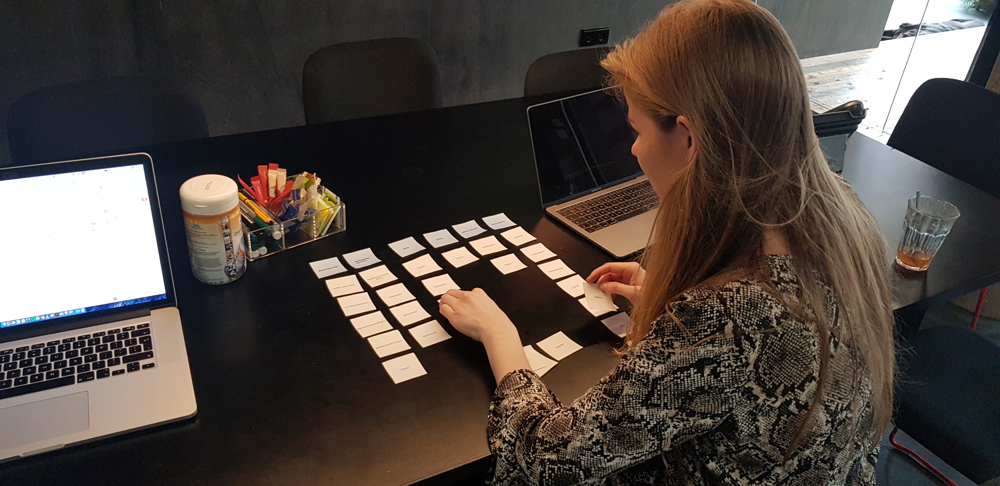
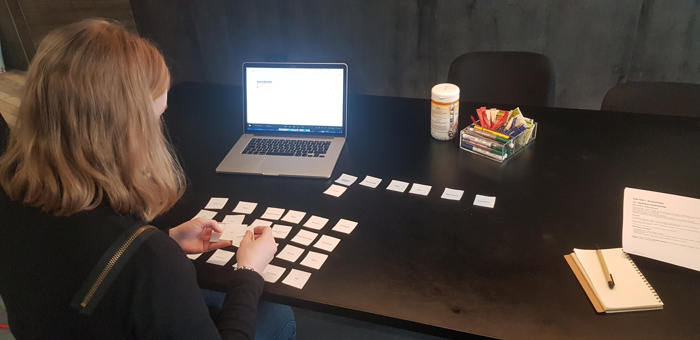
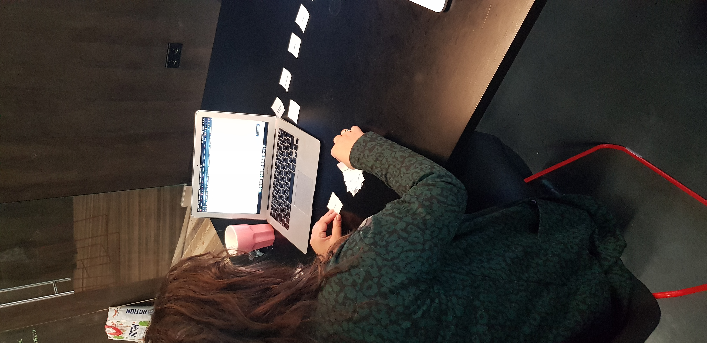

# 4.6 User tests v1

Deze User tests heb ik uitgevoerd met de eerste schermen die ik digitaal gemaakt heb. Dit was voor mij de eerste ronde van feedback met mensen uit de doelgroep. Deze User tests bestonden uit twee delen. Het eerste deel bestond uit Card Sorting met de testpersoon, en het tweede deel ging over de schermen die ik had gemaakt.

Tijdens deze User tests wilde ik een aantal dingen te weten komen;

* Navigatie structuur - welke structuur werkt het beste? Nav 1 of nav 2 
* Hoe is de flow van de website?
* De indeling / Structuur van de pagina’s
* Labels: zijn labels, ingangen en teksten duidelijk en vanzelfsprekend?
* Overzichtelijkheid van de pagina’s: Zijn de pagina’s logisch en te begrijpen?

In onderstaande documenten zijn de bevindingen te vinden. In 1 document staan de complete tests in van alle personen, in een andere staan alle bevindingen van deze tests en in de eerste staan de belangrijkste bevindingen die het meeste voorkwamen of die het meeste een aanpassing nodig hadden.















De bevindingen uit deze test ga ik verwerken in de volgende iteratie die ik ga doen. Door een paar keer te itereren, wil ik zo veel mogelijk problemen uit de designs halen en een zo goed mogelijk ontwerp hebben. 























