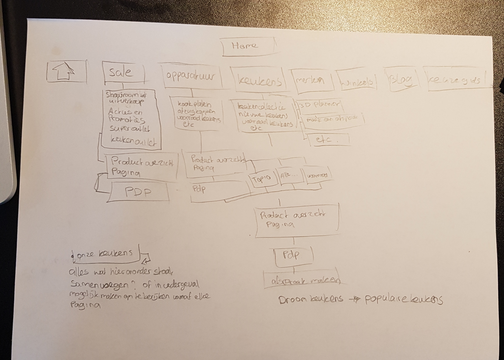
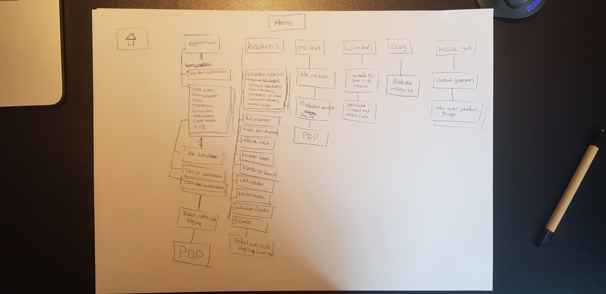
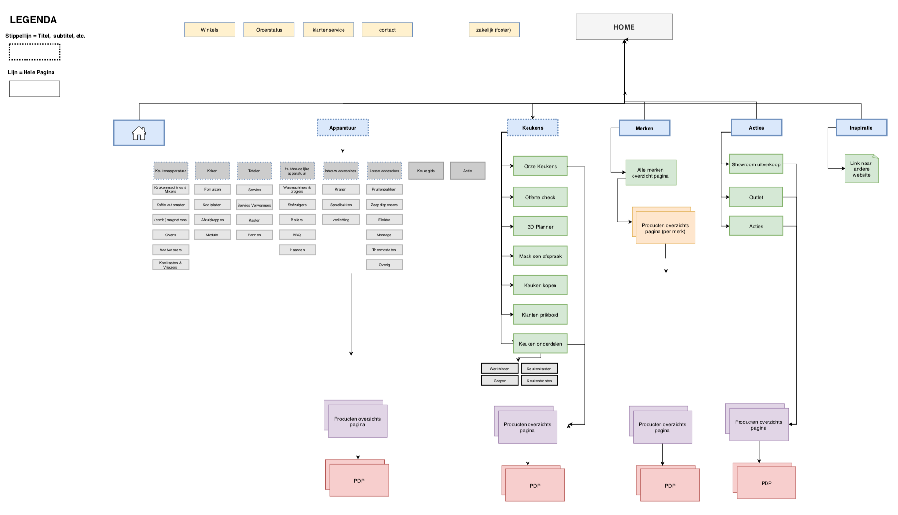
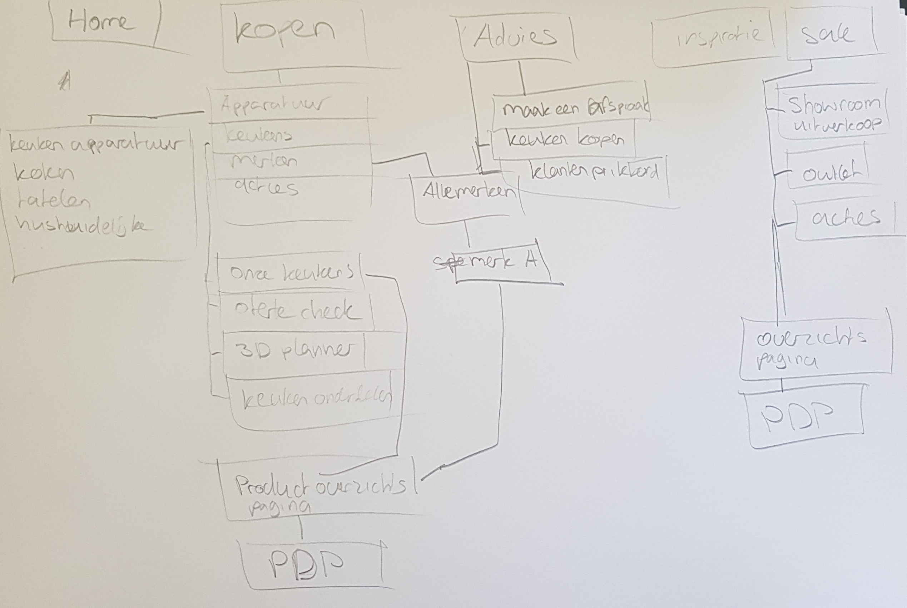

# 4.1 Nieuwe Sitemap

Voordat ik begon met het maken van de nieuwe schermen, was het belangrijk da ik nog eens goed ging kijken naar de structuur van de website. Uit mijn onderzoek is namelijk gebleken dat deze niet goed in elkaar zat en dat dit beter kon. Zodat de doelgroep makkelijker de producten kunnen vinden die ze zoeken. 

Wederom ben ik hier begonnen met het uitdenken en schetsen van de \(mogelijke\) sitemaps. Hierbij heb ik mijn bevindingen meegenomen.

Na het schetsen van de sitemap ben ik ze digitaal gaan maken. Hier heb ik ook twee verschillende sitemaps gemaakt voor de verschillende navigaties die ik wilde gaan testen. De sitemap van navigatie 2 is meer gericht op het doel van de bezoeker op de website, inplaats van de meer traditionele navigatie zoals navigatie 1. 

### Aanpassingen aan Navigatie 1

In deze nieuwe sitemap heb ik een aantal aanpassing doorgevoerd aan de hand van het onderzoek en de analyses die ik gedaan heb. De hoofd navigatie bestaat nu uit de volgende categorieën:

* **Apparatuur**
* **Keukens**
* **Merken**
* **Acties**
* **Inspiratie**

Het 'winkels' kopje is nu naar een side navigatie boven aan de pagina gegaan, omdat gebleken dat deze als minder belangrijk beschouwd werd tijdens de usability tests. Deze staat nu samen met 'order status', 'klantenservice' en 'contact' in een andere side navigatie.

Verder is de pagina tussen de overzichtspagina en de homepage ertussen uit, hiervoor was ook gebleken uit de usability tests dat deze pagina voor verwarring zorgde omdat mensen hem niet verwachtten. Verder zijn de verschillende pagina's die ze nu hebben voor alle keukens die ze aanbieden nu samengevoegd en staan ze onder het kopje 'Onze keukens'. 

Een ander belangrijk onderdeel is dat de acties nu veel beter worden uitgelicht. Op de huidige website zit er nergens in de hoofdnavigatie een link naar de actie pagina's, wel heb je in de navigatie linkjes naar de show room en de super outlet, maar deze springen er niet uit. Terwijl voor een prijsvechter het juist belangrijk is om de aanbiedingen en de goedkope producten goed naar voren te laten komen. Ook de doelgroep is opzoek naar goedkope producten, dus deze moeten ze makkelijk kunnen vinden. In de nieuwe sitemap en navigatie, komen deze veel meer naar voren. Het 'actie' kopje in de hoofd navigatie brengt je nu naar de superoutlet, omdat hier goedkope apparatuur wordt aangeboden en apparatuur is het belangrijkste onderdeel van de site. Verder zullen de 'showroom uitverkoop' en 'actie' pagina meer opvallen doordat deze een speciale plaats krijgen in het menu.

### Waarom navigatie 2?

Ik heb ervoor gekozen om twee verschillende navigaties te gaan testen, omdat ik er bij mijn interviews en de testen achter kwam dat de gebruikers bijna altijd met een duidelijk doel naar de website komen. Ze weten voordat ze naar de website gaan al vaak wat ze er willen doen, ze willen bijvoorbeeld apparatuur kopen, kijken naar een nieuwe keuken, Advies krijgen, etc. Dit viel mij op en daarom is bij mij het idee ontstaan om te kijken of ik hier een bijpassende navigatie bij kon maken. Een navigatie die is gericht op het doel van de gebruiker.

Voor deze navigatie heb ik de traditionele categorieën als: Apparatuur, keukens en merken niet in de eerste laag van de navigatie gezet. Wat de gebruiker nu ziet in de navigaties zijn de volgende categorieën: 

* **Kopen**
* **Advies**
* **Inspiratie**
* **Acties**

Hieronder heb je vervolgens nog verschillende lagen die verwijzen naar alle apparatuur, keukens, merken en acties. Bij advies staan nu pagina's die bij de huidige website nog onder het kopje '**Keukens'** staan. Zo zijn er een meerdere dingen anders dan navigatie 1. 

Om erachter te komen of deze navigatie ook daadwerkelijk goed werkt zal ik het moeten testen met mensen uit de doelgroep. Hieruit kan ik vervolgens beslissen of ik voor navigatie 1 of navigatie 2 moet gaan. Het resultaat van deze tests is te lezen op de pagina: User tests \(klik op de link hieronder om naar deze pagina te gaan\).



 

