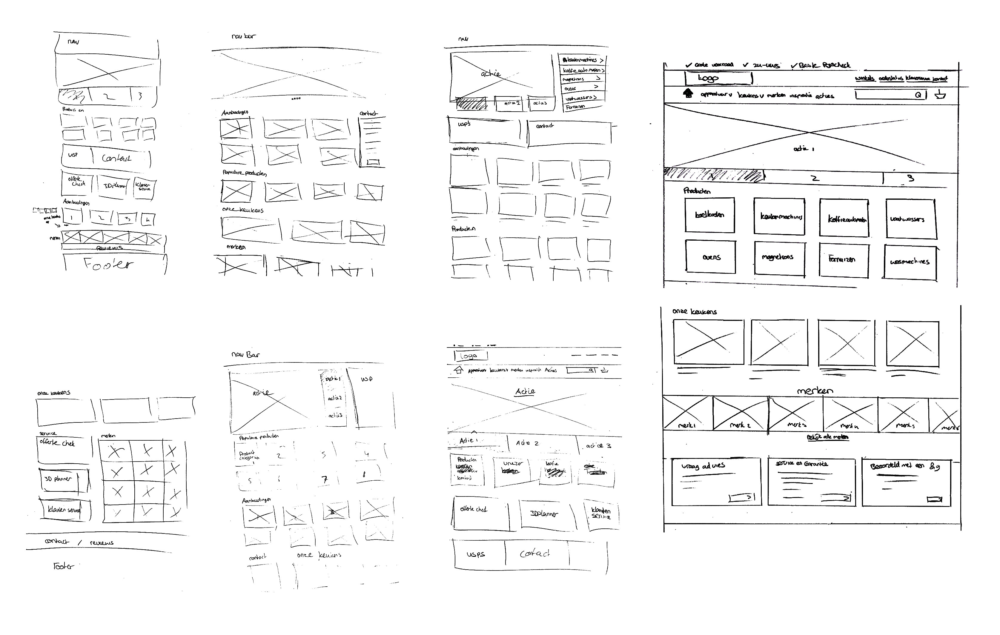
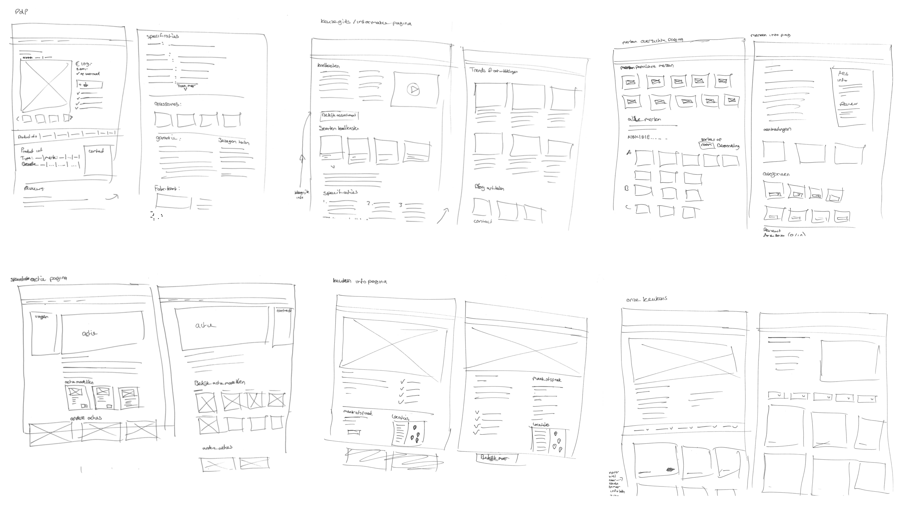
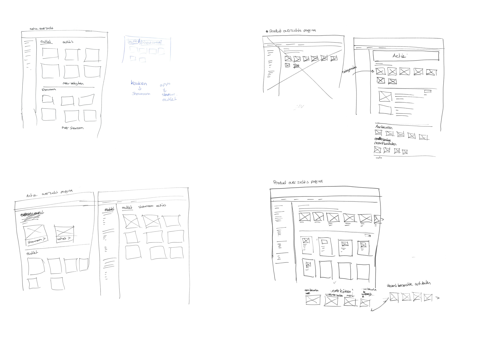

# 4.4 Wireframes maken

## Schetsen, schetsen en nog eens schetsen!

Het leukste gedeelte van mijn opdracht is begonnen, het is nu tijd om alles wat ik het onderzocht en gevonden uit te gaan werken in een nieuw ontwerp. Omdat ik niet de hele website op nieuw ga doen, ben ik begonnen met het bepalen van welke pagina's belangrijk zijn in mijn opdracht . Deze pagina's ben ik vervolgens gaan bedenken en uitschetsen. 

Nadat ik de schermen had geschetst heb ik het met mijn collega's van design erover gehad en hebben ik aan de hand van hun feedback nog wat aanpassingen gedaan en vervolgens ben ik de schermen gaan uitwerken. 



