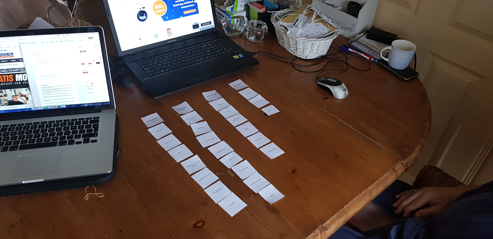
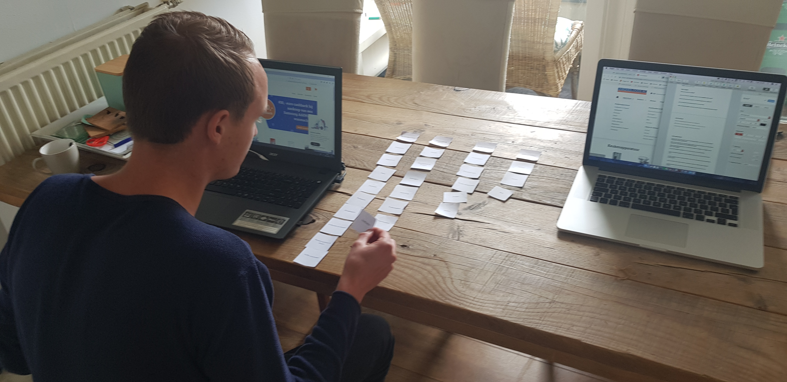
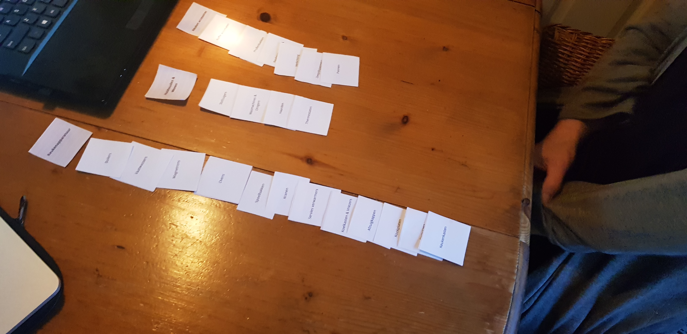
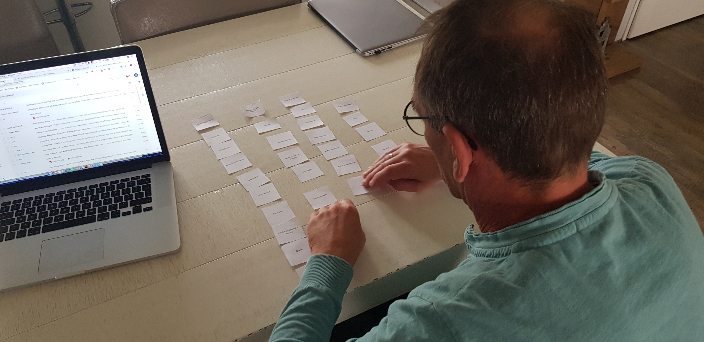

# 5.3 Card sorting v2

Tijdens deze user tests was het dus tijd om mijn nieuwe navigatie aan nieuwe card sorting sessies te ondervinden. Welke bevindingen kwamen hier uit en wat vonden de testpersonen er van?

Ook tijdens deze tests waren er een paar dingen die belangrijk waren:

* Wat vinden ze van de titels/categorieën?
* Wat vinden ze van de indeling?
* Hoe zouden ze het zelf indelen?
* Waar liggen de overeenkomsten tussen alle testpersonen?
* Wat moet er anders?

Tijdens de testen heb ik weer goed opgelet waarom ze bepaalde keuzes maakten, de reden waarom ze iets doen is voor mij belangrijk om uiteindelijk mijn eigen keuzes te maken. Die kan ik dan baseren op de keuzes die zij maakten.

### Wat waren de belangrijkste bevindingen?

* Wat meteen opviel was dat er veel meer overeenkomsten zijn dan de eerste sessie.
* De titels zijn veel duidelijker, het is makkelijker om een indeling te maken.
* BBQ werd door iedereen ingedeeld onder koken & tafelen, ipv huishouden & wonen \(hier had ik hem ingedeeld\).
* Servies verwarmers wordt meer bij keuken accesoires ingedeeld dan bij koken & tafelen
* Verlichting en montage ga ik indelen bij accesoires
* Modules komen op de pagina van 'keuken kasten' te staan.
* De mannen hebben er een andere kijk op dan vrouwen. Vrouwen zien namelijk apparatuur als iets dat je moet hebben in je keuken en accesoires iets dat je erbij kan hebben. Dit was opvallend dat alleen de vrouwen dit zo zagen en de mannen niet. De mannen zien apparatuur echt als 'iets met een motor\(tje\)'. 

Het was duidelijk bij deze testen dat de navigatie flink verbeterd is ten opzichte van de eerste indeling. Dit is natuurlijk erg leuk om te zien. De indelingen van de testpersonen komen veel meer overeen en zijn grotendeels hetzelfde. Natuurlijk zijn er verschillen en zijn ze niet 100% hetzelfde, maar dat is ook onmogelijk om het 100% hetzelfde te krijgen. Sommige producten kunnen nou eenmaal in meerdere categorieën. 

De resultaten zijn dus heel positief en ik heb nu genoeg informatie om een indeling te maken die dicht bij de wensen van de doelgroep komt. 

### **Wat ga ik nu nog aanpassen?**

Ik ga de gegeven feedback nog een keer verwerken, dit zijn vooral kleine aanpassingen aan de benaming van sommige onderdelen en kleine veranderingen in de indeling, zoals bijvoorbeeld 'Bbq' die naar 'koken & Tafelen' gaat.

Verder is een ding dat ik nog wil aanpassen is dat ik op dit moment een kopje met 'Overige artikelen' heb, hieronder vallen op dit moment: Modules, verlichting, montage, en accesoires. Maar omdat overig zo weinig zeg ga ik dit aanpassen door er accesoires van te maken. Hieronder vallen dan de artikelen van verlichting, montage en de producten die nu onder accesoires vallen. Het 'accesoires' kopje komt onder 'keuken accesoires' te staan. Hierdoor kan overig helemaal weggelaten worden en zijn toch alle producten te vinden in de navigatie.

Modules komt bij keuken kasten te staan omdat modules vaak gebruikt worden om als extra opberg ruimte, en dit is ook wat je met keuken kasten doet, dus ze hebben dezelfde functie. 

Bekijk hieronder alle feedback en de indelingen die uit de Card sorting sessies kwamen.



























