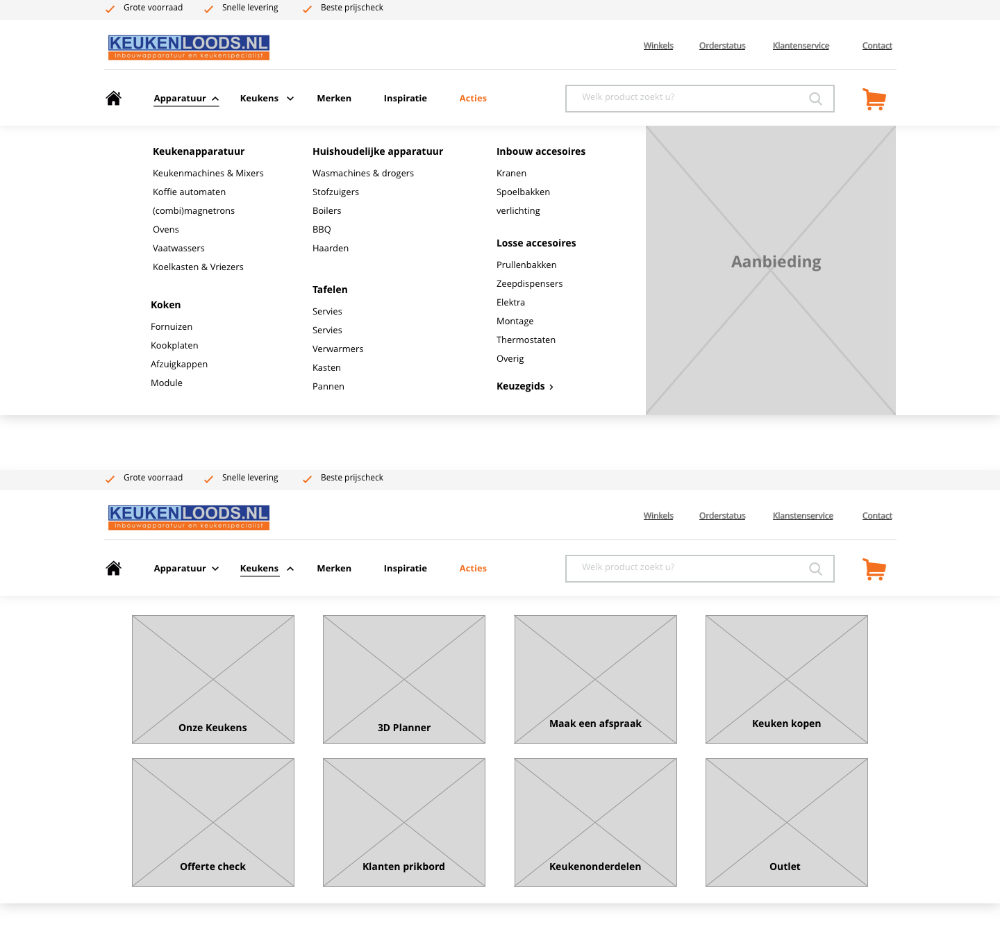
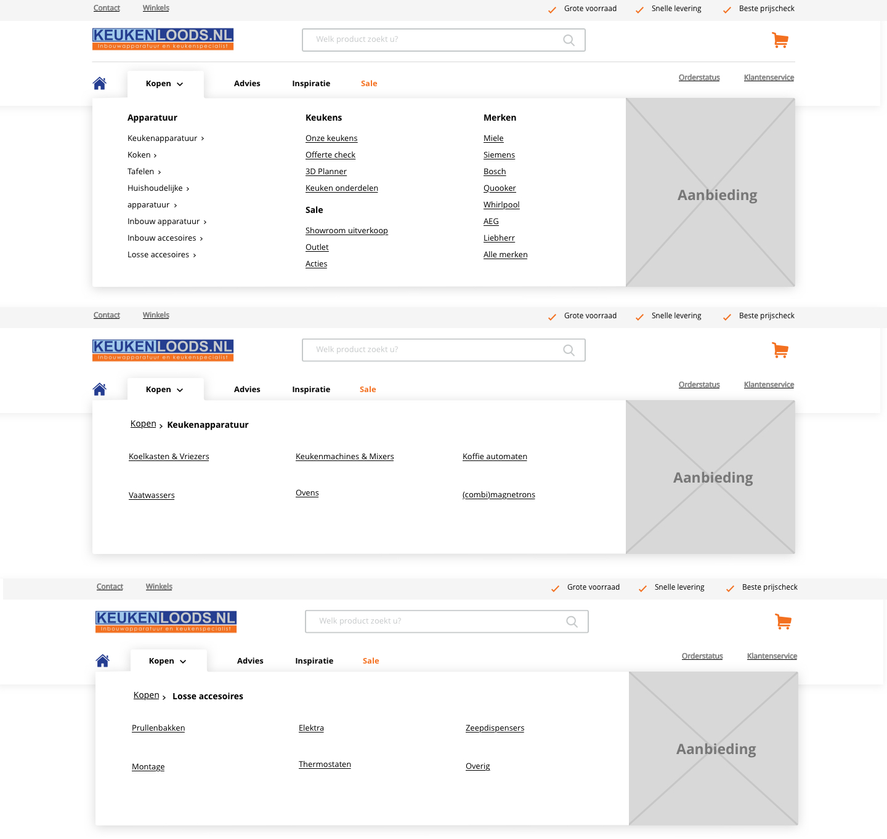
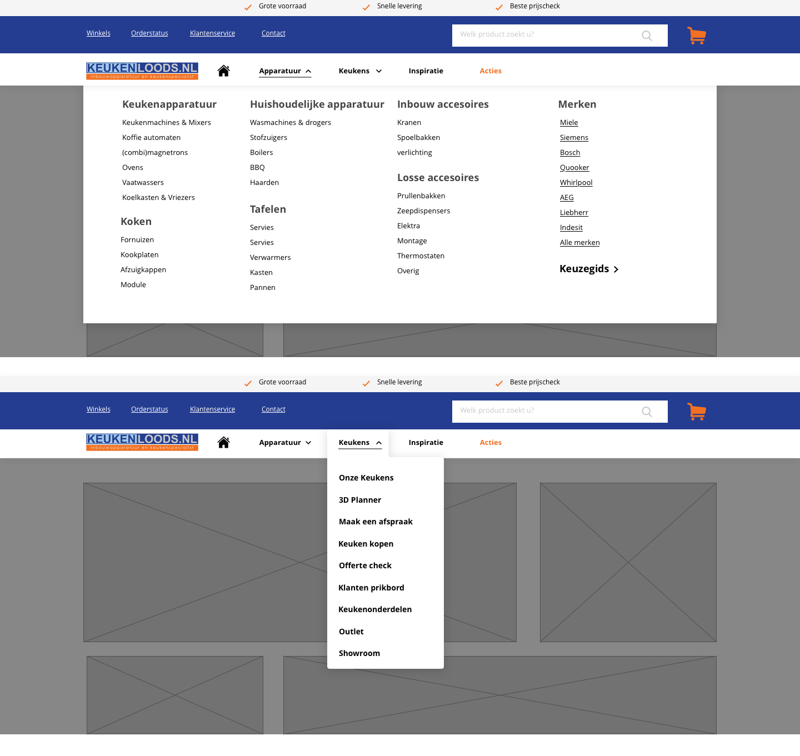
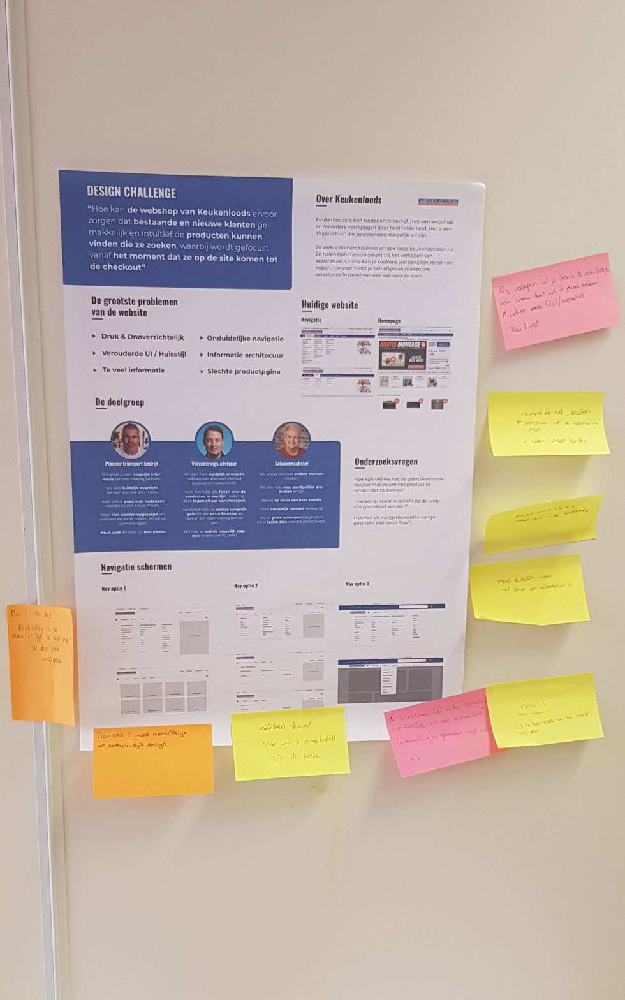

# Feedback Frenzy

Op 10 april was het tijd voor de Feedback Frenzy. Dit is een moment voor alle leerlingen en enkele begeleiders om feedback te krijgen over hun project. Begeleiders en mede leerlingen lopen langs je poster om met je te praten over je project, wat natuurlijk heel waardevol is.

Omdat je niet je hele project kan gaan uitleggen en over het hele project feedback kan krijgen was het de bedoeling dat je een onderdeel van je project kiest om feedback op te krijgen. 

### De navigatie

Het onderdeel waar ik feedback op wilde krijgen was de navigatie van de website. Ik heb namelijk twee verschillende soorten navigatie ontworpen die beter zouden moeten aansluiten op de behoeftes van de gebruikers. Ik kwam er tijdens mijn onderzoek namelijk achter dat gebruikers om twee redenen naar de website kwamen. 1. Om een product te zoeken en deze te kopen, 2. Het verzamelen van informatie / het krijgen van advies.

Ik wil daarom ook gaan testen of ik een navigatie kan maken die hier op aan sluit. Op het moment van de Feedback Frenzy had ik de navigaties nog niet getest, maar ik vond het een goed onderwerp om te kijken wat voor feedback ik hierop zou krijgen. 

## Poster:



## De navigaties















## Feedback

Tijdens deze Frenzy heb ik de volgende feedback op mijn navigatie gehad:

* Nav 1 is het meest overzichtelijk,
* Het kopje advies in de navigatie balk voelt alsof het op een andere plek hoort,
* Nav 1 is het meest herkenbaar en logisch,
* Misschien een optie toevoegen waarbij je kan zien welk apparatuur compatible is met welke keuken.
* Bij de verkopen optie in nav 1 meer foto's / inspiratie zodat je een idee krijg van de sfeer van wat ze allemaal verkopen.
* Bij nav 1 verwacht je dat de twee menus hetzelfde zouden zijn, het is verwarrend dat hier verschil in zit.

Duidelijk uit de Feedback van deze Frenzy is dat Nav 1 door bijna iedereen beter wordt beschouwd. Hij is makkelijker te begrijpen, is overzichtelijker, en heeft minder lagen waarder het pretigger werkt. 

Dit is duidelijke feedback over mijn navigaties, nav 2 lijkt in het nadeel te zijn nu en lijkt te complex voor de gebruikers. Toch wil ik de navigatie nog gaan testen met user tests om te kijken wat de gebruikers uit de doelgroep hiervan zeggen. De Feedback van deze Frenzy neem ik mee en zal ik in gedachtes houden als ik keuzes moet gaan maken.

