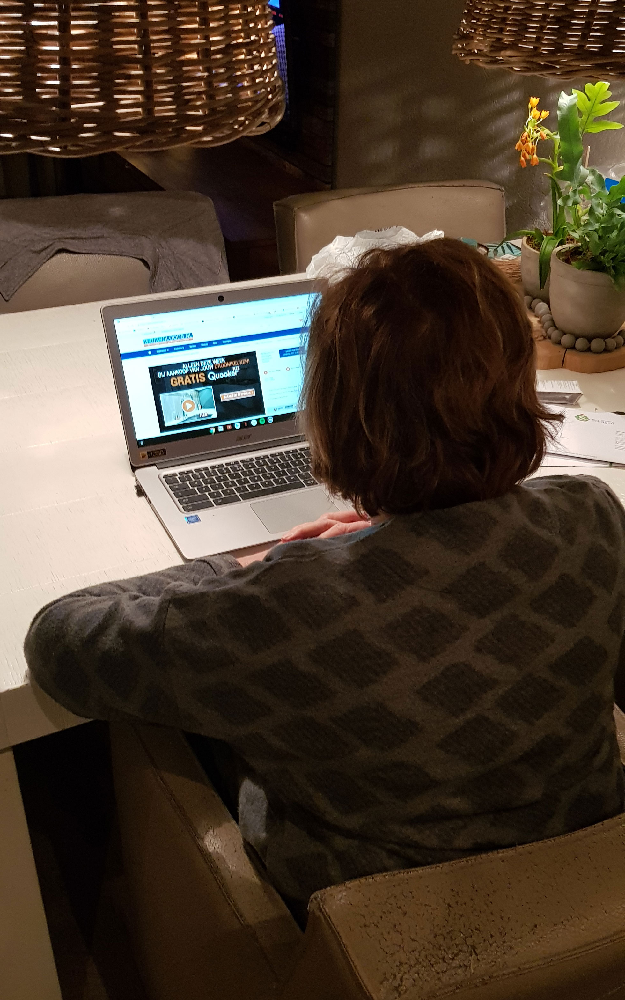
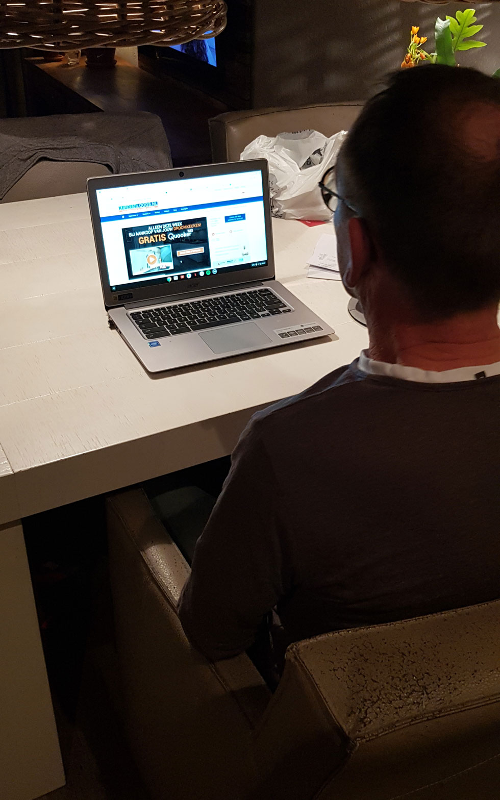
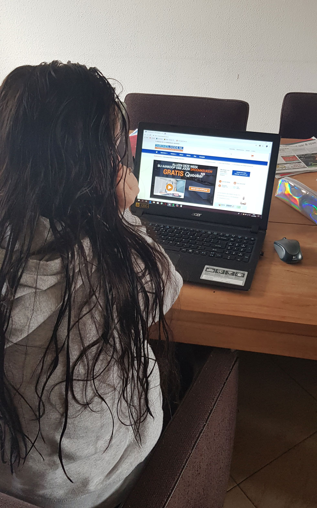
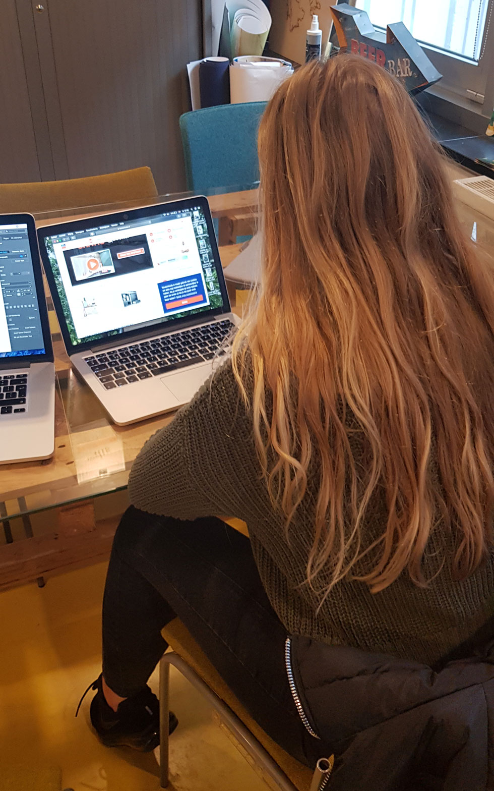

# 2.4 Usability tests / Interviews

Door middel van usability tests wil ik erachter komen waar bezoeker de grootste problemen ondervinden op de website. Hiervoor is het uitvoeren van usability tests natuurlijk perfect. Tijdens deze tests laat ik de gebruikers verschillende opdrachten uitvoeren om vervolgens te kijken hoe ze dit doen en ook vertellen ze mij tegelijkertijd wat er in hun hoofd om gaat bij die acties.

### Interviews

Nadat de usability tests klaar waren, heb ik de tijd genomen om deze persoon ook te interviewen om zo een beter beeld van de doelgroep te krijgen. Onder andere deze informatie heb ik vervolgens gebruikt bij het opstellen van persona's.

De usability tests en de interview vragen en antwoorden zijn beide te vinden in onderstaande documenten. Het eerste document is het bestand dat gebruikt is tijdens de testen om te noteren. Het document in het tweede tabblad is het uitgewerkte document met de bevindingen gesorteerd per onderwerp.





































