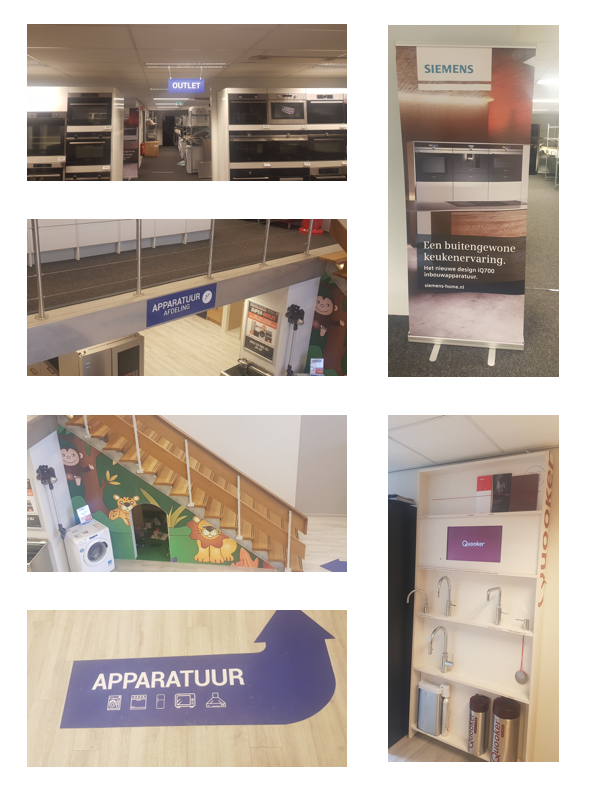
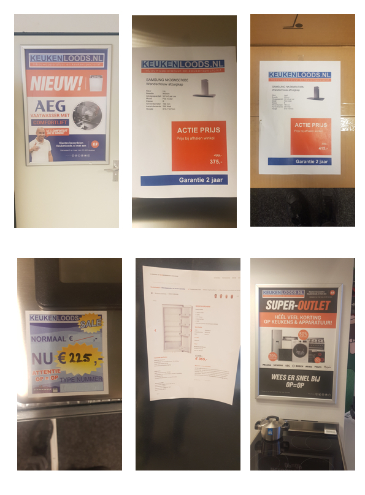
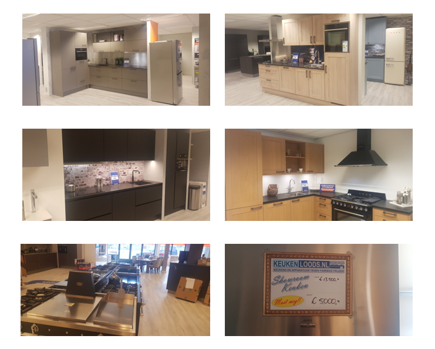
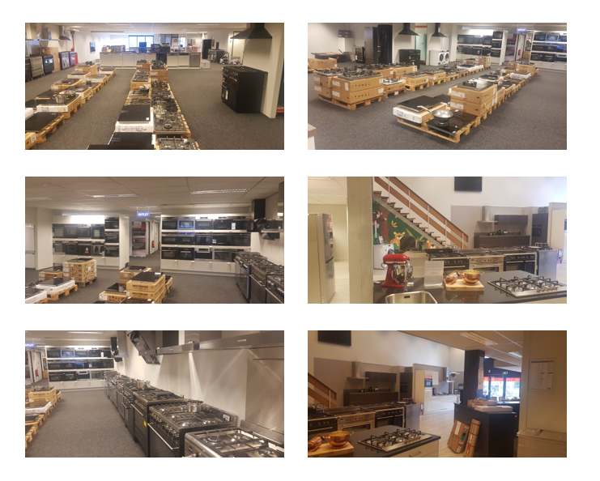

# 2.5 Bezoek aan de keukenloods winkel

## Keukenloods vestiging in Alkmaar

Ook ben ik langsgegaan bij de Keukenloods in Alkmaar. Dit is dus niet een hoofdkantoor, maar een winkel waar de klanten heen gaan. Hier heb ik een medewerker geïnterviewd en heb ik de winkel bekeken en foto's gemaakt. 

Een belangrijke bevinding was dat de medewerker mij vertelde dat mensen soms moeite hadden met het snel vinden van het juiste product. Ze konden dan door de vele pagina's en het filteren niet snel vinden wat ze zochten en dit zorgt voor ergernissen. Ook een belangrijke informatie die de medewerker mij vertelde was dat de focus van Keukenloods ligt op het verkopen van apparatuur, hier wordt het meeste geld mee op gehaald en loopt het beste. Natuurlijk zijn de keukens ook belangrijk, maar zowel met de webshop als in de winkel wordt het meeste geld opgehaald met de verkoop van apparatuur.



