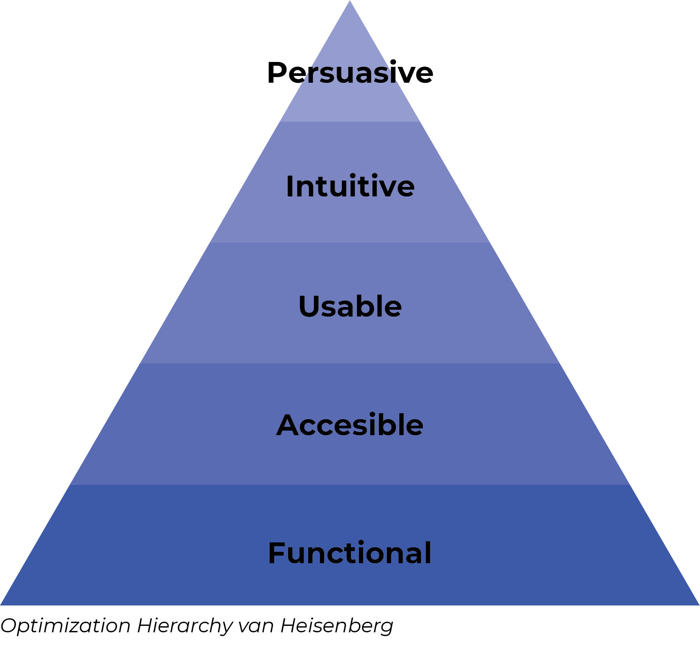

# 2.1 Analyse huidige website

## Optimization Hierarchy van Heisenberg

Als eerste stap heb ik om de website te analyseren, de Optimization Hierachy van Heisenberg gebruikt. Hiermee kijk je vanuit verschillende punten naar de website. Hiermee analyseer je de website waardoor je eventuele fouten of verbeterpunten kan identificeren.



### Bevindingen

Uit deze analyse zijn de volgende dingen naar boven gekomen. Deze punten neem ik mee in mijn uiteindelijke ontwerpen.

