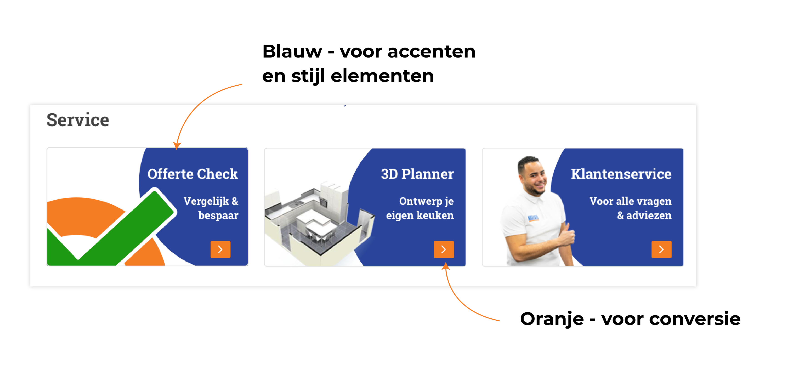

# Expert review

Als onderdeel van de validatie van mijn project heb ik een expert review van mijn product gedaan. Dit heb ik gedaan met mijn begeleidster; Eline Deutekom. Zij is creatief directeur van Reyez! en heeft veel ervaring op het gebied van design en webshops.

Uit deze Expert review kwamen er een aantal dingen naar boven die ik heb aangepast in het design. 1 belangrijk onderdeel dat ik nog heb aangepast is:

* Op dit moment maak ik gebruik van  2 verschillende kleuren \(naast het grijs en de platte tekst kleur\):
  * Blauw - Kleur voor de accenten en stijl elementen
  * Oranje - De Conversie kleur.

De feedback die ik kreeg was om er nog een highlight kleur aan toe te voegen. Door deze derde kleur toe kan je een beter onderscheid maken in het gebruik van de kleuren. Hierdoor zou ik de volgende indeling van de kleuren krijgen:

* Blauw - Interactie kleur
* \(Nieuwe highlight kleur\) - Wordt de kleur van elementen die uitgelicht worden maar niet klikbaar zijn.
* Oranje - Conversie kleur

Blauw en oranje worden dan dus elementen waar je op kan klikken waarbij oranje alleen gebruikt wordt voor knoppen die zorgen voor conversie. De nieuwe kleur is voor elementen die uitgelicht worden maar die niet klikbaar zijn.

### Wat kwam er nog meer naar boven?

* De afbeelding boven aan de outlet pagina, moet ook oranje.
* Op sommige elementen een button neerzetten voor een duidelijkere CTA
* De titel van de keuken staat nu twee keer op de detail pagina, 1 hiervan weghalen
* Alle labels aanpassen aan de highlight kleur
* De 'offerte check' button op de keuken detail pagina omdraaien met de 'maak een afspraak' button.
* De Klantenservice bar aanpassen

Dit waren de belangrijkste punten die naar boven kwamen en die ik heb aangepast in mijn uiteindelijke ontwerp.

Verder vond ze dat mijn ontwerp goed in elkaar zat en ze vond vooral de verschillende manieren van het verbeteren van de flow een goede en nuttige verbetering. Ook de uitstraling van het ontwerp en de overzichtelijkheid vond ze verbeterd. Er is een duidelijk verschil in stijl maar de website is nog steeds herkenbaar als Keukenloods!

