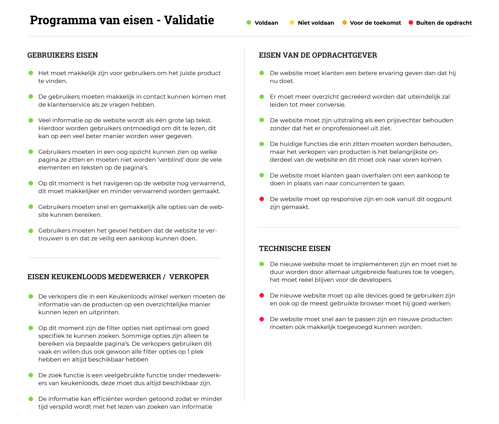

# Programma van eisen - Validatie

Op deze pagina is mijn reflectie op mijn programma van eisen te zien. Deze heb ik aan het begin van het project opgesteld en nu is het tijd om te kijken of mijn eindproduct voldoet aan de eisen. Omdat ik mijn focus pas later in het project kon bepalen, zijn sommige eisen minder belangrijk of relevant voor mijn project. Ik heb de originele lijst aangehouden en zoals je hieronder kan zien voldoet hij aan de meeste eisen.

In totaal zijn **17 van de 20** eisen behaald.

* **Gebruikers eisen**

  * 7 van de 7 - Behaald

* **Eisen van de opdrachtgever**

  * 5 van de 6 behaald
  * 1 van de 6 buiten de opdracht

* **Medewerker / Verkoper eisen**

  * 4 van de 4 - Behaald

* **Technische eisen**
  * 1 van de 3 - Behaald
  * 2 van de 3 - Buiten de opdracht

De eisen waar hij niet aan voldoet zijn de eisen die te maken hebben met de responsive website en het technische onderdeel van de website, maar deze waren geen onderdeel van mijn ontwerp. 

