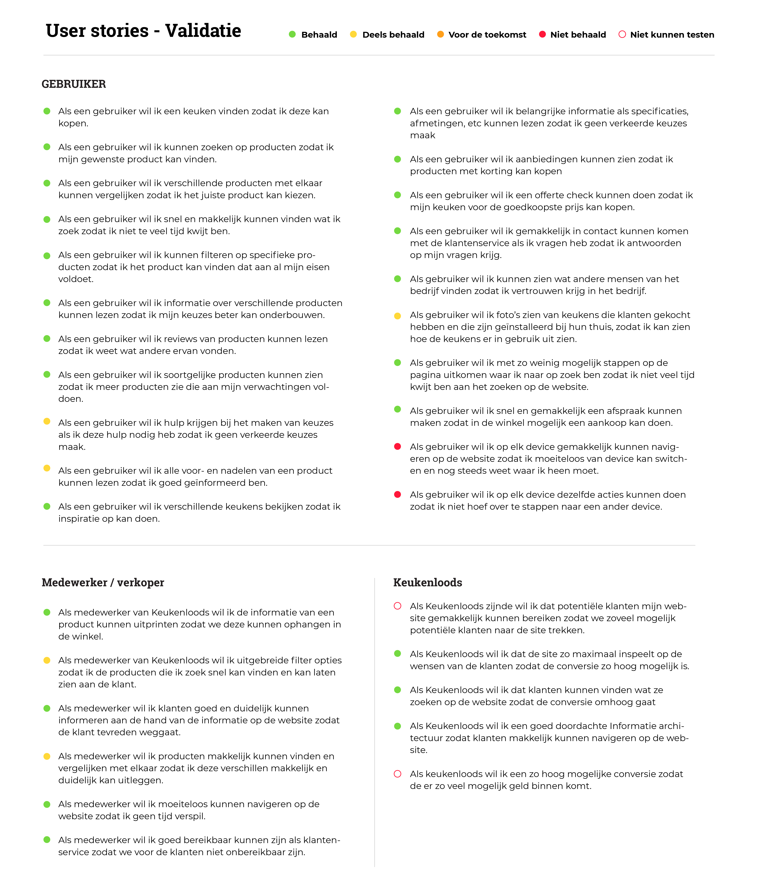

# User stories - Validatie

Hier zijn mijn opgestelde User stories te lezen die ik aan het begin heb opgesteld. Nu we aan het einde van mijn project zijn heb ik gekeken hoe mijn product overeenkomt met deze eisen. Per user story heb ik aangegeven of ze behaald zijn, deels behaald zijn, voor de toekomst of dat ze niet behaald zijn. 

In totaal zijn **23 van de 32** user stories behaald.

* **Gebruiker**

  * 16 van de 21 - Behaald
  * 3 van de 21 - Deels behaald
  * 2 van de 21 - niet behaald / buiten de scope van mijn opdracht.

* **Medewerker / Verkoper**

  * 4 van de 6 - Behaald
  * 2 van de 6 - Deels behaald

* **Keukenloods**
  * 3 van de 5 - Behaald
  * 2 van de 5 - Niet kunnen testen omdat het een prototype is en het buiten mijn project valt.

De gele \(deels behaalde\) stories zijn onderdelen die eventueel nog toegevoegd zouden kunnen worden om de gebruikers nog meer in zijn behoeften te voorzien. Dit zijn geen 'must haves' maar extra opties/functies die eventueel toegevoegd zouden kunnen worden \(could haves\).

De rode stories zijn stories die buiten mijn project vallen, deze gaan over het responsive gedeelte, maar dit is iets waar ik geen rekening mee heb gehouden omdat mijn product over de desktop versie gaat.

De niet ingevulde rode stories zijn onderdelen die ik niet kan bevestigen omdat de site hiervoor online zou moeten staan. Deze onderdelen kan je niet testen met een prototype.

